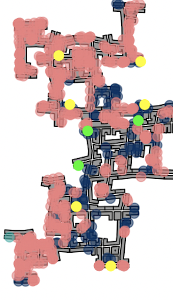
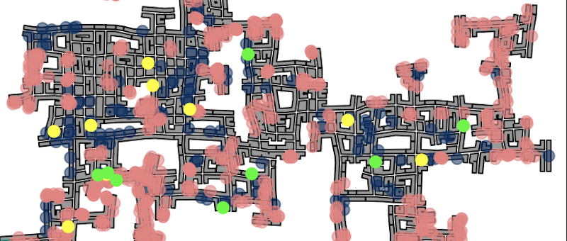
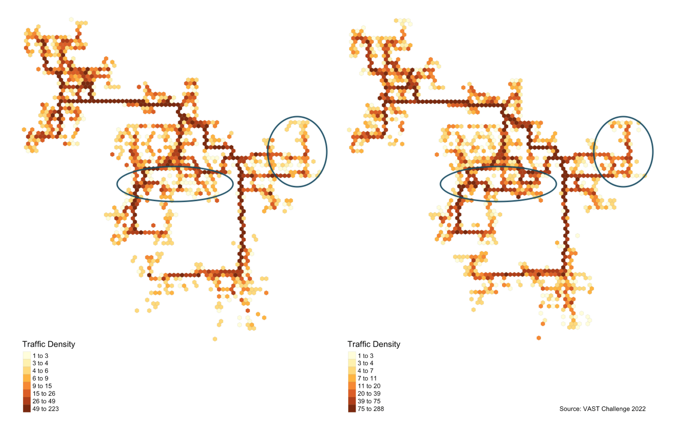

```{r setup, include=FALSE}
knitr::opts_chunk$set(message = FALSE)
```

# 1. Overview
## 1.1 Introduction
With reference to Challenge 2 Question 3 of [VAST Challenge 2022](https://vast-challenge.github.io/2022/), this take-home exercise will reveal:

* social areas of the city of Engagement, Ohio USA.
* visualizing and analyzing locations with traffic bottleneck of the city of Engagement, Ohio USA.

*Challenge 2: Patterns of Life*

*Assuming the volunteers are representative of the city’s population, characterize the distinct areas of the city that you identify. For each area you identify, provide your rationale and supporting data. *

*Where are the busiest areas in Engagement? Are there traffic bottlenecks that should be addressed? Explain your rationale.*

## 1.2 Methodology
This take-home exercise aims to reveal the social areas of the city from two aspects and cross-check: 

* by plotting the restaurants and pubs locations;
* by plotting the locations of participants' when their mood is  *At Recreation* and *At Restaurant*;

The former reveals where we expect as the social areas of the city as participants can socialize at restaurants and pubs, and the latter shows the actual and the frequency of participants visiting the social areas in the city. 

As for the bottlenecks of the city, this take-home exercise will reveal them by plotting residents transport patterns during **morning and afternoon peak hours during weekdays**, and analyzing the areas that most residents travel pass. In this exercise, the morning peak hours is defined as 7-9am and afternoon peak hours is defined as 5-7pm according to the example given in Cleveland, Ohio [here](https://en.wikipedia.org/wiki/Rush_hour#United_States). 

For the purpose of this exercise, status log 1 will be analyzed, which contains data for the duration of 6 days and is sufficient to reveal the pattern at the start of the study. 

# 2. Data Preparation
## 2.1 Install and Load Packages 
The following code chunk installs the required R packages and loads them onto RStudio environment. sf, an R package specially designed to handle geospatial data in simple feature objects.

```{r load libraries, results='hide'}
packages = c('tidyverse', 'sf', 'tmap', 'lubridate', 'clock',
             'sftime', 'rmarkdown')
for (p in packages){
  if(!require(p, character.only = T)){
    install.packages(p)
  }
  library(p,character.only = T)
}
```

## 2.2 Import Datasets
Well-known text (WKT) is a human readable representation for spatial objects like points, lines, or enclosed areas on a map. 

In the code chunk below, `read_sf()` of *sf* package is used to parse the location files, such as buildings, restaurants, pubs, schools, apartments and employers, into R as an sf data.frame.

```{r import data}
buildings <- read_sf('data/Buildings.csv',
                   options= 'GEOM_POSSIBLE_NAMES=location')
restaurants <- read_sf('data/Restaurants.csv',
                   options= 'GEOM_POSSIBLE_NAMES=location')
pubs <- read_sf('data/Pubs.csv',
                   options= 'GEOM_POSSIBLE_NAMES=location')
schools <- read_sf('data/Schools.csv',
                   options= 'GEOM_POSSIBLE_NAMES=location')
apartments <- read_sf('data/Apartments.csv',
                   options= 'GEOM_POSSIBLE_NAMES=location')
employers <- read_sf('data/Employers.csv',
                   options= 'GEOM_POSSIBLE_NAMES=location')
```

```{r import raw, eval=FALSE}
logs1 <- read_sf('data/rawdata/ParticipantStatusLogs1.csv',
                   options= 'GEOM_POSSIBLE_NAMES=currentLocation')
```

## 2.3 Data Wrangling
The following code chunk creates a new column *Timestamp* that converts the time of the record into POSIXct format. Using this column, day of the week and hour of the day columns are also created using `wday()` and `hour()`. 
`filter()` is used to extract social records and transport records during weekday peak hours (7-9am and 5-7pm). 

```{r extract, eval=FALSE}
logs1_selected <- logs1 %>%
  mutate(Timestamp = date_time_parse(timestamp,zone = '',
                                     format = '%Y-%m-%dT%H:%M:%S'),
         day = wday(Timestamp, label = TRUE),
         hour = hour(Timestamp))

# Social Records 
logs1_social <- logs1_selected %>%
  filter(currentMode == 'AtRecreation' | 
           currentMode == 'AtRestaurant')

# transport during weekday AM peak hours
logs1_tram <- logs1_selected %>%
  filter(currentMode == 'Transport' &
         (day == 'Mon'| day == 'Tue'| day=='Wed'| day=='Thu'| day=='Fri') &
         (hour ==7| hour ==8))

# transport during weekday PM peak hours
logs1_trpm <- logs1_selected %>%
  filter(currentMode == 'Transport' &
         (day == 'Mon'| day == 'Tue'| day=='Wed'| day=='Thu'| day=='Fri') &
         (hour ==17| hour ==18))
```

## 2.4 Save as and Read RDS
The extracted status log data is saved as and read in RDS format to avoid uploading large files onto Git. 

```{r save RDS, eval=FALSE}
write_rds(logs1_social, 'data/rds/logs1_social.rds')
write_rds(logs1_tram, 'data/rds/logs1_tram.rds')
write_rds(logs1_trpm, 'data/rds/logs1_trpm.rds')
```

```{r read rds}
logs1_social <- read_rds('data/rds/logs1_social.rds')
logs1_tram <- read_rds('data/rds/logs1_tram.rds')
logs1_trpm <- read_rds('data/rds/logs1_trpm.rds')
```

# 3. Visualizations and Insights 
## 3.1 Tmap of the City 
The code chunk below plots the building polygon features by using `tm_polygon()`  well as restaurants and pubs using `tm_shape()`. 
To better reveal the locations of restaurants and pubs, the other location types are plotted first to avoid overlapping and in transparent colors by setting `alpha= 0.6`. In addition, restaurants and pubs are assigned brighter colors.  

```{r tmap, fig.width= 6, fig.height= 8}
labs <- c('Restaurant', 'Pub', 'Employer', 'Apartment', 'School')
cols <- c('#ffff00', '#00ff00', "#003366", '#f08080', '#20b2aa')

map <- tm_shape(buildings) +
  tm_polygons(col = "grey60",
           size = 1,
           border.col = "black",
           border.lwd = 1,
           border.alpha = 0.5) +
  tm_shape(employers) +
  tm_dots(col = "#003366", size = 0.3, alpha= 0.6) +
  tm_shape(apartments) +
  tm_dots(col = '#f08080', size = 0.3, alpha= 0.6 ) +
  tm_shape(schools) +
  tm_dots(col = '#20b2aa', size = 0.3, alpha= 0.6) +
  tm_shape(restaurants) +
  tm_dots(col = '#ffff00', size = 0.3) +
  tm_shape(pubs) +
  tm_dots(col = '#00ff00', size = 0.3) +
  tm_add_legend(title = 'Location Types',
                type = 'symbol',
                border.col = NA,
                labels = labs,
                col = cols) +
  tm_layout(main.title = 'Map of Engagemnt City, Ohio USA',
            frame = FALSE) +
  tm_compass(size = 2,
             position = c('right', 'top')) +
  tm_credits('Source: VAST Challenge 2022')

map
```

**Insights**

From the above map, we observe that the most active social areas (with most number of restaurants and pubs) are in the north-west region and central region of the city. While the rest of the areas have few restaurants and pubs. 

{width=20%}

{width=40%}

## 3.2 Hexagon Map for Social Areas 
In the code chunk below, `st_make_grid()` of sf package is used to create hexagons.

```{r haxegons}
hex <- st_make_grid(buildings, 
                    cellsize=100, 
                    square=FALSE) %>%
  st_sf() %>%
  rowid_to_column('hex_id')
plot(hex)
```

In the code chunk below, `st_join()` of sf package is used to count the number of event points in the hexagons.

```{r count event points}
points_in_hex <- st_join(logs1_social, 
                         hex, 
                         join= st_within) %>%
  st_set_geometry(NULL) %>%
  count(name = 'pointCount', hex_id)
head(points_in_hex)
```

In the code chunk below, `left_join()` of dplyr package is used to perform a left-join by using hex as the target table and points_in_hex as the join table. The join ID is hex_id.

```{r join hexid}
hex_combined <- hex %>%
  left_join(points_in_hex, 
            by = 'hex_id') %>%
  replace(is.na(.), 0)
```

In the code chunk below, tmap package is used to create the hexagon binning map for social locations. 

```{r hexagon social, fig.width=8, fig.height=10}
social <- tm_shape(hex_combined %>%
           filter(pointCount > 0))+
  tm_fill("pointCount",
          title = 'Customer Visit Records',
          n = 8,
          style = "quantile") +
  tm_borders(alpha = 0.1) +
  tm_layout(main.title = 'Social Areas of Engagemnt City, Ohio USA\nSocial Hexagon Map',
            frame = FALSE) +
  tm_compass(size = 2,
             position = c('right', 'top')) +
  tm_credits('Source: VAST Challenge 2022')

social
```

The following code chunk compares the hexagon map of social areas against the map of the city showing the location of the restaurants and pubs to check if they are consistent. 

```{r map & social, fig.width=12, fig.height=10}
tmap_arrange(map, social)
```

**Insights**

* Comparing the two plots, it is clear that some most of the pubs are very popular and restaurant visits are spread out more equally, as the denser the color of the hexes, the more records of staying at the respective location by the participants. This is probably because that there are more restaurants than pubs in the city, therefore visits to pubs are more concentrated. Also, as the records are updated every 5min, and we already know from analyzing the prosperity of the businesses that participants tend to stay for longer periods at the pubs, leading to more records of visits for pubs than restaurants in general. 
* Generally, both plots are showing similar trends that the north-west area and the central area are the social areas of the city. While there are some restaurants and pubs in the south of the city, they are not as popular or well-frequented by the participants. 

## 3.3 Hexagon Map for Weekday Peak Hours 
In the code chunk below, `st_join()` of sf package is used to count the number of event points in the hexagons for both AM and PM weekday peak hours. 

```{r count event points2}
points_in_hextram <- st_join(logs1_tram, 
                         hex, 
                         join= st_within) %>%
  st_set_geometry(NULL) %>%
  count(name = 'pointCount', hex_id)

points_in_hextrpm <- st_join(logs1_trpm, 
                         hex, 
                         join= st_within) %>%
  st_set_geometry(NULL) %>%
  count(name = 'pointCount', hex_id)

```

In the code chunk below, `left_join()` of dplyr package is used to perform a left-join by using hex as the target table and points_in_hex as the join table. The join ID is hex_id.

```{r join hexid2}
hex_combinedtram <- hex %>%
  left_join(points_in_hextram, 
            by = 'hex_id') %>%
  replace(is.na(.), 0)

hex_combinedtrpm <- hex %>%
  left_join(points_in_hextrpm, 
            by = 'hex_id') %>%
  replace(is.na(.), 0)
```

In the code chunk below, tmap package is used to create the hexagon binning map for both AM and PM weekday peak hours. 

```{r hexagon ampm, fig.width=12, fig.height=10}
am <- tm_shape(hex_combinedtram %>%
           filter(pointCount > 0))+
  tm_fill("pointCount",
          title = 'Traffic Density',
          n = 8,
          style = "quantile") +
  tm_borders(alpha = 0.1) +
  tm_layout(main.title = 'Traffic Bottleneck of Engagemnt City, Ohio USA\nWeekday AM Peak Hours',
            frame = FALSE)

pm <- tm_shape(hex_combinedtrpm %>%
           filter(pointCount > 0))+
  tm_fill("pointCount",
          title = 'Traffic Density',
          n = 8,
          style = "quantile") +
  tm_borders(alpha = 0.1) +
  tm_layout(main.title = '\nWeekday PM Peak Hours',
            frame = FALSE) +
  tm_compass(size = 2,
             position = c('right', 'top')) +
  tm_credits('Source: VAST Challenge 2022')

tmap_arrange(am, pm)
```

**Insights**

* From the comparison of the AM and PM weekday peak hours bottleneck hexagon plots, it is observed that both follows a generally similar pattern where the main routes connecting the the north-west area to the central area and to the south area of the city are likely to see traffic bottlenecks during peak hours. This is consistent with the map of the city as the apartments and workplaces are well spreaded-out in the north-west, central as well as south of the city. 
* There are some slight differences in the AM PM traffic pattern, which is consistent with what we already know about participants daily routines:  most of them travel from home to work in the morning but some go to recreations after work while some go back home. The following picture highlights the slight differences in traffic bottlenecks for AM and PM peak hours. The differences are consistent with some of the pubs' locations in the central areas of the city. 



# 4. Learning Points
This week we focused on geo-spatial analytics and visualizations, where we explored Well-known text (WKT) data and working with R packages such as [`sf`](https://r-spatial.github.io/sf/) and [`tmap`](https://cran.r-project.org/web/packages/tmap/vignettes/tmap-getstarted.html). I find that the learning experience really opened my eyes on what data visualization can do outside of the usual statistical graphs.
